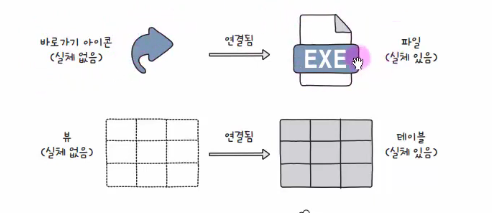
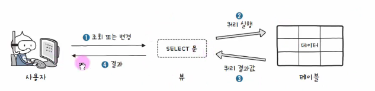

# 가상의 테이블 : VIEW(뷰)

---


# 1. VIEW(뷰)란?

- VIEW는 하나 이상의 테이블을 기반으로 생성되는 **가상의 테이블(Virtual Table)** 이다.

- 실제 데이터를 별도로 저장하지 않고, SELECT 결과를 보여주는 객체이다.

- 일반 VIEW는 물리적 데이터를 저장하지 않음



---

## 특징

- 실제 테이블처럼 조회 가능
- SELECT 문 기반으로 생성
- 복잡한 SQL 단순화 가능
- 특정 데이터만 노출 가능

-  VIEW는 보안 및 쿼리 단순화 목적으로 자주 사용됨

---

# 2. VIEW 조회

```sql
SELECT 컬럼명
FROM 뷰이름
WHERE 조건;
```

-  VIEW도 일반 테이블처럼 SELECT 가능



---

# 3. VIEW 생성

## 기본 문법

```sql
CREATE VIEW 뷰이름 AS
SELECT 컬럼명
FROM 테이블명
WHERE 조건;
```

---

## 예시

```sql
CREATE VIEW active_users AS
SELECT id, name
FROM users
WHERE status = 'ACTIVE';
```

-  VIEW의 실체는 SELECT 문

---

# 4. CREATE VIEW 옵션

## OR REPLACE

- 기존 VIEW가 존재하면 덮어쓰기

```sql
CREATE OR REPLACE VIEW 뷰이름 AS
SELECT ...
```

-  Oracle/MySQL 등에서 지원

---

## WITH CHECK OPTION

- VIEW 조건을 만족하는 데이터만 수정 가능

```sql
CREATE VIEW 뷰이름 AS
SELECT *
FROM 회원
WHERE 나이 >= 20
WITH CHECK OPTION;
```

-  VIEW 조건 위반 데이터 입력 방지

---

## WITH READ ONLY

- 읽기 전용 VIEW 생성

```sql
CREATE VIEW 뷰이름 AS
SELECT *
FROM 회원
WITH READ ONLY;
```

-  수정 불가능 VIEW 생성

---

# 5. VIEW 구조 확인

```sql
DESCRIBE 뷰이름;
```

또는

```sql
DESC 뷰이름;
```

-  MySQL에서 VIEW 구조 확인 가능

---

# 6. VIEW 삭제

```sql
DROP VIEW 뷰이름;
```


---

## RESTRICT / CASCADE

```sql
DROP VIEW 뷰이름 CASCADE;
```

- CASCADE → 의존 객체 함께 삭제


---

# 7. VIEW를 사용하는 이유

## 7.1 데이터 보안

- 사용자에게 필요한 컬럼만 공개 가능

### 예시

```sql
CREATE VIEW user_info AS
SELECT id, name
FROM users;
```

- 비밀번호(password) 숨김 가능

-  VIEW는 접근 제어 목적으로 사용 가능

---

## 7.2 복잡한 SQL 단순화

- 복잡한 JOIN 쿼리를 재사용 가능

```sql
CREATE VIEW order_summary AS
SELECT ...
FROM orders
JOIN users ...
```

-  반복 SQL 재사용 가능

---

## 7.3 논리적 독립성

- 실제 테이블 구조 변경 영향을 줄일 수 있음

-  완전한 독립성 보장은 어려움

---

# 8. VIEW 특징 정리

| 특징 | 설명 |
|------|------|
| 가상 테이블 | 실제 데이터 저장 안함 |
| SELECT 기반 | 조회 결과 저장 |
| 보안 | 일부 데이터만 공개 가능 |
| SQL 단순화 | 복잡한 쿼리 재사용 가능 |

-  VIEW는 논리적 테이블 역할 수행

---

# 9. VIEW의 단점

## 9.1 수정 제한

- 복잡한 VIEW는 INSERT/UPDATE/DELETE 제한 가능

### 제한되는 경우

- GROUP BY
- DISTINCT
- UNION
- 집계 함수 사용

-  복합 VIEW는 수정 불가능한 경우 많음

---

## 9.2 성능 문제

- VIEW 조회 시 내부 SELECT가 실행됨

-  복잡한 VIEW는 성능 저하 가능

---

## 9.3 INDEX 직접 생성 불가

- 일반 VIEW 자체에는 INDEX 생성 불가

- Materialized View는 예외 가능

-  일반 VIEW는 실제 저장 구조가 없음

---

# 10. 핵심 정리

- VIEW = 가상의 테이블
- 실제 데이터는 원본 테이블 존재
- 보안 및 SQL 단순화 목적
- 복잡한 VIEW는 수정 제한 존재

-  VIEW는 실무에서 매우 자주 사용됨

---

# 참고

-  VIEW는 SQL 표준 기능
