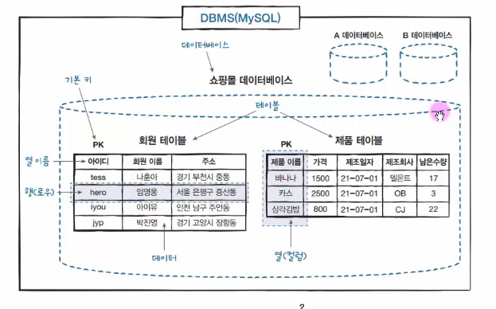

# 데이터베이스 모델링 정리

---

## 1. 데이터베이스 모델링

- 데이터베이스 모델링은 **테이블 구조를 사전에 설계하는 과정**이다.
- 건축 설계도를 그리는 과정과 유사하다.
- 현실 세계의 개체(사물, 개념)를 **DBMS의 데이터베이스 객체로 변환하는 과정**이다.
- 현실 모델의 정보를 **테이블 형태로 구조화하는 작업**이다.
-  데이터베이스 모델링은 개념적/논리적/물리적 설계를 포함하는 핵심 단계
-  현실 세계 → 데이터 구조로 변환하는 과정이라는 정의는 표준적

---

## 2. 프로젝트 진행 단계

- 프로젝트는 현실 세계의 업무를 **컴퓨터 시스템으로 구현하는 과정**이다.

### 일반적인 흐름

1. 요구사항 분석
2. 데이터베이스 모델링
3. 설계(개념적 모델링, 논리적 모델링, 물리적 모델링)
4. 구현
5. 테스트 및 배포

-  소프트웨어 개발에서 요구사항 → 설계 → 구현 흐름은 표준 프로세스

---

## 3. 전체 데이터베이스 구성 요소

### 3.1 테이블 (Table)

- 데이터를 저장하기 위한 **표 형태의 구조**
- 하나의 테이블은 하나의 개체(Entity)를 표현
-  테이블은 관계형 데이터베이스의 기본 단위

---

### 3.2 데이터베이스 (Database)

- 여러 개의 테이블이 저장되는 **논리적 저장소**

-  데이터베이스는 구조화된 데이터 집합

---

### 3.3 DBMS

- 데이터베이스를 관리하는 **소프트웨어 시스템**

-  DBMS는 데이터 생성, 조회, 수정, 삭제 기능 제공

---

### 3.4 열 (Column)

- 테이블의 **세로 방향 구조**
- 각 열은 데이터의 속성(Attribute)을 의미

-  컬럼은 속성을 나타내는 개념

---

### 3.5 열 이름 (Column Name)

- 각 열을 구분하기 위한 이름
- **하나의 테이블 내에서 중복 불가**

-  동일 테이블 내 컬럼 이름은 유일해야 함

---

### 3.6 데이터 형식 (Data Type)

- 열에 저장될 데이터의 타입  
  (예: INT, VARCHAR, DATE 등)

-  데이터 타입은 저장 가능한 값의 범위를 제한함

---

### 3.7 행 (Row)

- 실제 데이터 한 건 (Record)
- 테이블의 **가로 방향 데이터**

-  행은 하나의 엔티티 인스턴스를 의미

---

## 4. 핵심 정리

- 모델링 = 현실 → 테이블 구조로 변환
- 테이블 = 데이터 저장 구조
- 열 = 속성
- 행 = 실제 데이터
- DBMS = 데이터 관리 시스템

-  위 개념은 관계형 데이터베이스의 기본 구조

---

## 참고

-  관계형 데이터 모델은 E.F. Codd 이론 기반
