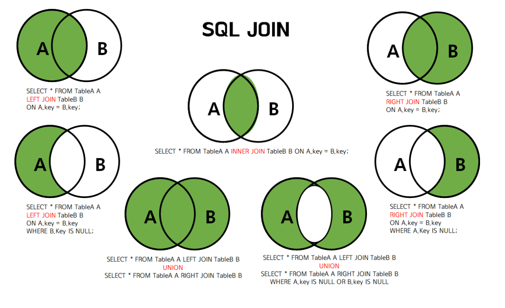
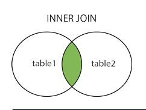
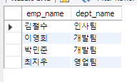
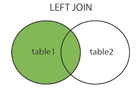
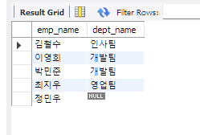
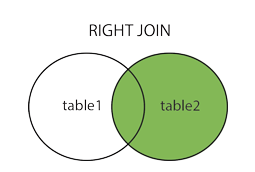
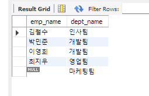

# SQL JOIN 정리 (INNER, OUTER, CROSS, SELF)


---

## 1. JOIN 개요



- JOIN은 **두 개 이상의 테이블을 연결하여 하나의 결과를 만드는 기능**이다.

-  JOIN은 관계형 데이터베이스의 핵심 기능
-  2개 이상 테이블 조인 가능

---

## 실습 데이터

```sql
-- 2. 부서 테이블 생성
CREATE TABLE departments (
    dept_id INT PRIMARY KEY,
    dept_name VARCHAR(50) NOT NULL
);

-- 3. 직원 테이블 생성
CREATE TABLE employees (
    emp_id INT PRIMARY KEY,
    emp_name VARCHAR(50) NOT NULL,
    dept_id INT,
    salary INT
);

-- 4. 부서 데이터 삽입
INSERT INTO departments (dept_id, dept_name) VALUES
(1, '인사팀'),
(2, '개발팀'),
(3, '영업팀'),
(4, '마케팅팀'); -- 직원이 없는 부서

-- 5. 직원 데이터 삽입
INSERT INTO employees (emp_id, emp_name, dept_id, salary) VALUES
(101, '김철수', 1, 3500000),
(102, '이영희', 2, 4500000),
(103, '박민준', 2, 5000000),
(104, '최지우', 3, 3800000),
(105, '정민우', NULL, 3000000); -- 부서가 없는 직원
```


---
## 2. INNER JOIN (내부 조인)

- 두 테이블 모두에 **공통으로 존재하는 데이터만 조회**
- null 값을 가지는 tuple은 조인된 테이블에 포함되지 않는다.



### 문법

```sql
SELECT 컬럼목록
FROM 테이블1
INNER JOIN 테이블2
ON 조인조건
WHERE 조건;
```

---

### 특징

- 가장 많이 사용되는 JOIN
- 교집합 개념

-  INNER JOIN은 매칭되는 데이터만 반환

## 실습 예시 
부서가 배치된 직원들의 이름과 해당 부서명을 출력하세요. (부서가 없거나 직원이 없는 부서는 제외)

```sql
SELECT e.emp_name, d.dept_name
from employees e
INNER JOIN departments d ON e.dept_id = d.dept_id;
```


---

## 3. OUTER JOIN (외부 조인)

- 한쪽 테이블에만 데이터가 있어도 결과에 포함

### 종류

- LEFT JOIN
- RIGHT JOIN
- FULL OUTER JOIN

---

### 3.1 LEFT JOIN



```sql
SELECT 컬럼목록
FROM 테이블1
LEFT JOIN 테이블2
ON 조인조건;
```

- 왼쪽 테이블 기준 → 모두 출력

## 예시문제
모든 직원의 이름과 부서명을 출력하세요. 부서가 없는 직원('정민우')도 포함되어야 합니다.

```sql
SELECT e.emp_name, d.dept_name
FROM employees e
LEFT JOIN departments d ON e.dept_id = d.dept_id;
```



---

### 3.2 RIGHT JOIN



```sql
SELECT 컬럼목록
FROM 테이블1
RIGHT JOIN 테이블2
ON 조인조건;
```

## 예시문제
모든 부서명과 해당 부서에 속한 직원 이름을 출력하세요. 직원이 없는 부서('마케팅팀')도 포함되어야 합니다.
```java
SELECT e.emp_name, d.dept_name
FROM employees e
RIGHT JOIN departments d ON e.dept_id = d.dept_id;
```



- 오른쪽 테이블 기준 → 모두 출력

---

### 3.3 FULL OUTER JOIN

```sql
SELECT 컬럼목록
FROM 테이블1
FULL OUTER JOIN 테이블2
ON 조인조건;
```

- 양쪽 테이블 모두 포함

- ❗ 중요 (MySQL 기준)
    - MySQL은 **FULL OUTER JOIN을 직접 지원하지 않음** -> 성능상 안 좋다.

-  LEFT/RIGHT JOIN은 표준 지원
-  MySQL은 FULL OUTER JOIN 미지원

---

## 4. CROSS JOIN (상호 조인)

- 두 테이블의 **모든 행을 조합 (Cartesian Product)**

```sql
SELECT *
FROM 테이블1
CROSS JOIN 테이블2;
```

---

### 특징

- 결과 행 수 = 테이블1 행 수 × 테이블2 행 수

- ❗ 기존 오류 수정  
  → "랜덤으로 조인된다" ❌  
  → "모든 조합 생성" ✅

- ❗ ON 절 사용 불가

-  CROSS JOIN은 모든 조합 생성

---

## 5. SELF JOIN (자체 조인)

- 하나의 테이블을 자기 자신과 조인

```sql
SELECT A.컬럼, B.컬럼
FROM 테이블명 A
JOIN 테이블명 B
ON A.컬럼 = B.컬럼;
```

---

### 특징

- 같은 테이블을 두 번 사용하는 구조
- 별칭(A, B) 필수

---

### 사용 예

- 계층 구조 (직원-상사 관계)
- 카테고리 트리

- ❗ 기존 오류 수정  
  → "실무에서 거의 안쓴다" ❌  
  → "계층 구조에서 자주 사용" ✅

-  SELF JOIN은 계층형 데이터 처리에 사용

---

## 6. JOIN 핵심 비교

| JOIN 종류 | 설명 |
|----------|------|
| INNER JOIN | 교집합 |
| LEFT JOIN | 왼쪽 기준 |
| RIGHT JOIN | 오른쪽 기준 |
| FULL JOIN | 합집합 |
| CROSS JOIN | 모든 조합 |
| SELF JOIN | 자기 자신과 조인 |

-  JOIN 종류별 결과 차이는 면접 핵심

---

## 7. 실행 순서 (JOIN 포함)

```text
FROM → JOIN → WHERE → GROUP BY → HAVING → SELECT → ORDER BY
```

-  JOIN은 FROM 단계에서 수행

---

## 8. 핵심 정리

- JOIN = 테이블 연결
- INNER JOIN = 교집합
- OUTER JOIN = 한쪽 포함
- CROSS JOIN = 모든 경우의 수
- SELF JOIN = 자기 자신

-  JOIN은 SQL에서 가장 중요한 개념 중 하나


---

## 참고

-  관계형 DB에서 JOIN은 필수 기능

## 출처:
https://inpa.tistory.com/entry/MYSQL-%F0%9F%93%9A-JOIN-%EC%A1%B0%EC%9D%B8-%EA%B7%B8%EB%A6%BC%EC%9C%BC%EB%A1%9C-%EC%95%8C%EA%B8%B0%EC%89%BD%EA%B2%8C-%EC%A0%95%EB%A6%AC

