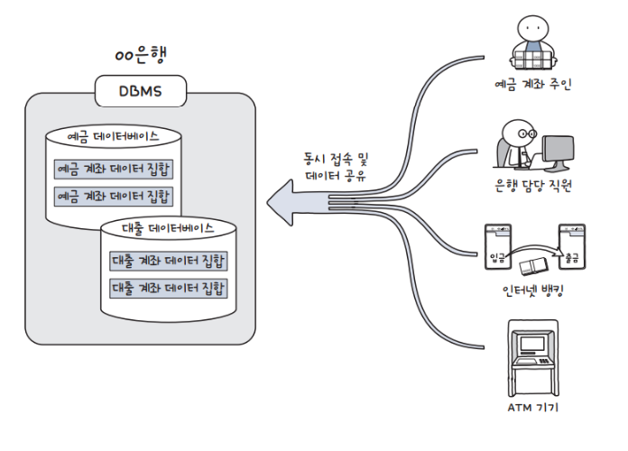

# 데이터베이스 기초 정리

## 1. 데이터베이스란?

- 데이터베이스(Database, DB)는 여러 응용 프로그램 또는 사용자들이 공유, 이용 할 수 있도록 체계적으로 통합, **데이터의 집합**이다.
- 단순한 파일 저장이 아니라, **체계적으로 저장되고 관리되는 데이터 모음**을 의미한다.

-  데이터베이스는 조직적으로 구조화된 데이터 집합이라는 정의는 학계 및 산업에서 널리 사용됨

## 데이터베이스의 데이터 특징

### 통합 데이터(Integratied Data)
여러가지 데이터를 통합해 저장하는데 중복된 정보를 그대로 저장하면 용량 낭비가 발생한다.
따라서 데이터베이스 중복된 정보에 대해 데이터를 통합하여 자료의 중복을 최소화하고자 한다.

### 저장 데이터(Stored Data)
컴퓨터가 접근할 수 있는 매체에 데이터를 저장한다.

### 운영 데이터(Operational Data)
데이터베이스는 주로 조직의 목적을 위해 존재하고 활용되는 운영데이터를 다루는데 이용된다. 

### 공유 데이터(Shared Data)
여러 사람들이 공유하고 사용할 목적으로 통합 관리되는 데이터이다. 데이터베이스라는 SW를 사용하는 가장 근본적인 이유가 된다.
하나의 컴퓨터나 시스템들이 공용으로 액세스하여 이용한다.

## 데이터베이스의 기능 특징
최소한의 중복만을 허용하는 통합데이터
실시간 접근성: 데이터베이스는 사용자의 요구에 신속 정확하게 응답이 가능해야 한다.
지속적이고 동적인 변화: 데이터의 Insert, Delete, Update로 항상 최신의 데이터베이스에 있는 데이터를 참조할 때 사용자의 요구에 따른 데이터 내용으로 데이터의 위치나 주소를 찾음(주소x)
동시 공용: 다수의 사용자가 동시에 같은 내용의 데이터를 이용할 수 있어야 한다.(여러 고객이 같은 상품을 동시에 주문)

---

## 2. DBMS(Database Management System)

- DBMS는 데이터베이스를 **관리하고 운영하는 소프트웨어**이다.
- 사용자는 DBMS를 통해 데이터를 저장, 조회, 수정, 삭제할 수 있다.

### 주요 역할
- 데이터 저장 및 관리
- 데이터 무결성 유지
- 동시성 제어
- 보안 관리

-  DBMS는 데이터 관리 시스템으로 정의되며 위 기능은 표준적인 역할

---

## 3. DBMS 종류

대표적인 DBMS:

- MariaDB
- OracleDB
- MySQL
- PostgreSQL

위 DBMS들은 대표적인 관계형 DBMS로 널리 사용됨

---

## 4. SQL (Structured Query Language)

- SQL은 DBMS에서 데이터를 **정의하고 조작하기 위한 표준 언어**이다.

### 주요 기능

- 데이터 정의 (DDL)
- 데이터 조작 (DML)
- 데이터 제어 (DCL)

-  SQL은 ANSI/ISO 표준 언어로 정의되어 있음

---

## 5. 관계형 DBMS (RDBMS)

- RDBMS는 데이터를 **테이블 형태로 관리하는 DBMS**이다.

### 특징

- 테이블(Table)을 최소 단위로 사용
- 행(Row)과 열(Column) 구조
- 관계(Relation)를 기반으로 데이터 연결

### 테이블 구조

| 컬럼 (Column) | 설명 |
|--------------|------|
| 열(Column)   | 속성(Attribute) |
| 행(Row)      | 데이터 한 건 (Record) |

-  RDBMS는 테이블 기반 구조를 사용하며 이는 관계형 모델의 핵심
-  행과 열 구조는 관계형 데이터 모델의 기본 구성 요소
-  모든 시스템에서 관계를 적극적으로 활용하는 것은 아님

---

## 6. 핵심 정리

- 데이터베이스 = 데이터의 집합
- DBMS = 데이터베이스를 관리하는 소프트웨어
- SQL = 데이터베이스를 다루는 언어
- RDBMS = 테이블 기반 데이터베이스 시스템

-  위 개념 구조는 데이터베이스 기초 개념으로 표준적으로 사용됨

---

## 참고

-  관계형 데이터베이스 개념은 E.F. Codd의 관계형 모델 이론 기반

